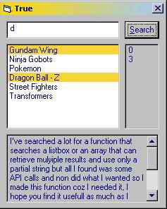

<div align="center">

## vbFindInList \- \( NO API \)


</div>

### Description

This searches for a string in a listbox, it can retrieve multiple results and can use only partial string..
 
### More Info
 
The string to search for, and the listbox to search in.

True if found, and it highlights the list items that contains the search criteria.


<span>             |<span>
---                |---
**Submitted On**   |2003-11-27 19:18:32
**By**             |[Yaser Hani](https://github.com/Planet-Source-Code/PSCIndex/blob/master/ByAuthor/yaser-hani.md)
**Level**          |Intermediate
**User Rating**    |5.0 (55 globes from 11 users)
**Compatibility**  |VB 6\.0
**Category**       |[Coding Standards](https://github.com/Planet-Source-Code/PSCIndex/blob/master/ByCategory/coding-standards__1-43.md)
**World**          |[Visual Basic](https://github.com/Planet-Source-Code/PSCIndex/blob/master/ByWorld/visual-basic.md)
**Archive File**   |[vbFindInLi16769311272003\.zip](https://github.com/Planet-Source-Code/yaser-hani-vbfindinlist-no-api__1-50154/archive/master.zip)

### API Declarations

```
'This is how it's done the EASY WAY, No API declarations required..suitable for small to medium lists...enjoy..
Function vbFind(vbString As String, vbList As ListBox, Optional iStart As Integer) As Boolean
  Dim vbWhere As String
  vbFind = False
  If iStart < 0 Then iStart = 0
  If vbString <> "" Then
    For i = iStart To vbList.ListCount - 1
      vbString = LCase(vbString)
      vbWhere = LCase(vbList.List(i))
      If InStr(1, vbWhere, vbString) > 0 Then
        vbFind = True
        Debug.Print (i)
        vbList.Selected(i) = True
        iStart = i + 1
      End If
    Next i
  End If
  If vbFind = False Then MsgBox "Search string not found, Please make sure that you've entered the file name correctly and try again.", vbCritical, "Error"
End Function
```


